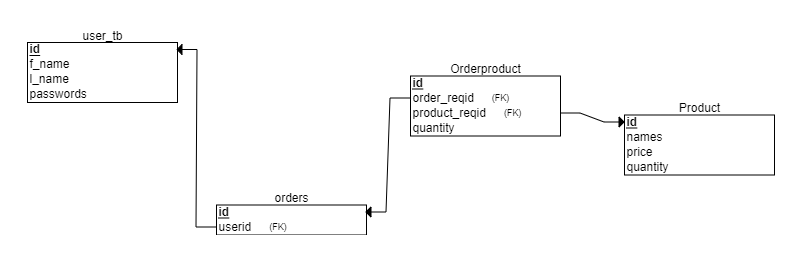

# API Requirements
The company stakeholders want to create an online storefront to showcase their great product ideas. Users need to be able to browse an index of all products, see the specifics of a single product, and add products to an order that they can view in a cart page. You have been tasked with building the API that will support this application, and your coworker is building the frontend.

These are the notes from a meeting with the frontend developer that describe what endpoints the API needs to supply, as well as data shapes the frontend and backend have agreed meet the requirements of the application. 


<p align="center"> schame diagrame </p>

## API Endpoints
* #### Products

|   **API Route**  | **API**   | **Token**     |   **check**    |      
|   :---:    |  :----:     |     :---:           |     :----:   |         
| GET INDEX  | /api/products/findAll | Require   |   ✅        |                   
| GET SHOW    |/api/products/:id     |Require   |       ✅     |               
| POST CREATE |/api/products/create|  Require   |       ✅        |               


#

* #### Users


|   **API Route**  | **API**   | **Token**   |   **check**     |      
|   :---:     |  :----:     |     :---:      |     :----:      |         
| GET INDEX   | /api/user/  |      Require   |       ✅        |                   
| GET SHOW    |/api/user/:id|      Require   |       ✅        |               
| POST CREATE | /api/user/register|  Require |       ✅        |               
| POST CREATE  |/api/user/signin|  Require   |   ✅    (Auth ) |               
| PATCH CREATE  |/api/user/:id/edit|Require  |       ✅        |               
| DELETE CREATE  |/api/user/:id/delete| Require |       ✅    |               


* #### Orders

|   **API Route**  | **API**   | **Token**  | **check** |  DEC               |
|:---: |  :----:           |  :---:  |:----:| --- |                
| GET  |/api/orders/:Userid| Require |   ✅   |Current Order by user|           
| GET  |/api/orders/:oid   | Require |   ✅     | Show               |       
| GET  |/api/orders/oid/Orderproduct |  Require |✅|order product        |       
|POST|/api/orders/oid/addproductorder|Require|✅|add order to product|       
|POST  |/api/orders/createorder|  Require  |  ✅|create order       |       


## Data Shapes
#### Product
-  id
- name
- price
- [OPTIONAL] category


```sql
/* Replace with your SQL commands */
 /* Replace with your SQL commands */
--   LOAD EXTENSION UUID
CREATE EXTENSION IF NOT EXISTS "uuid-ossp";

-- CREATE PRODUCT TABLE
CREATE TABLE product(
id uuid DEFAULT uuid_generate_v4() PRIMARY KEY,
 names VARCHAR(100),
 price INTEGER
 );
 
```
#### User
- id
- firstName
- lastName
- password
```sql
/* Replace with your SQL commands */
CREATE EXTENSION IF NOT EXISTS "uuid-ossp";
--   LOAD EXTENSION UUID
-- CREATE TABLE
CREATE TABLE user_tb
(id uuid DEFAULT uuid_generate_v4() PRIMARY KEY ,
 f_name VARCHAR(100),
 l_name VARCHAR(50),
 passwords VARCHAR(100)
 );
 

```
#### Orders
- id
- id of each product in the order
- quantity of each product in the order
- user_id
- status of order (active or complete)

```sql 
/* Replace with your SQL commands */
CREATE EXTENSION IF NOT EXISTS "uuid-ossp";
-- create  order table
-- CREATE ORDER TABLES
-- LAOD UUID
CREATE EXTENSION IF NOT EXISTS "uuid-ossp";

CREATE TABLE orders(
id uuid DEFAULT uuid_generate_v4() PRIMARY KEY,
userid uuid 
 );
 
-- SET/ADDS relationship
 ALTER TABLE orders 
 ADD CONSTRAINT user_fk FOREIGN KEY(userid)
 REFERENCES user_tb(id) ;
 

 /* Replace with your SQL commands */
-- LOAD UUID
CREATE EXTENSION IF NOT EXISTS "uuid-ossp";
-- CREATA ORDER PRODUCT TABLE
CREATE TABLE Orderproduct(
 id uuid DEFAULT uuid_generate_v4() PRIMARY KEY,   
 order_reqid uuid  ,
 product_reqid uuid  ,
 quantity INTEGER DEFAULT 1
 );
 
--  ALTER TABLES TO ADD RELATIONSHIP
  ALTER TABLE Orderproduct 
 ADD CONSTRAINT order_fk FOREIGN KEY(order_reqid)
 REFERENCES orders(id) ;
-- ALTER TABLE TO ADD RELATION SHIP
 ALTER TABLE Orderproduct 
 ADD CONSTRAINT orderproduct_fk FOREIGN KEY(product_reqid)
 REFERENCES product(id) ;

```